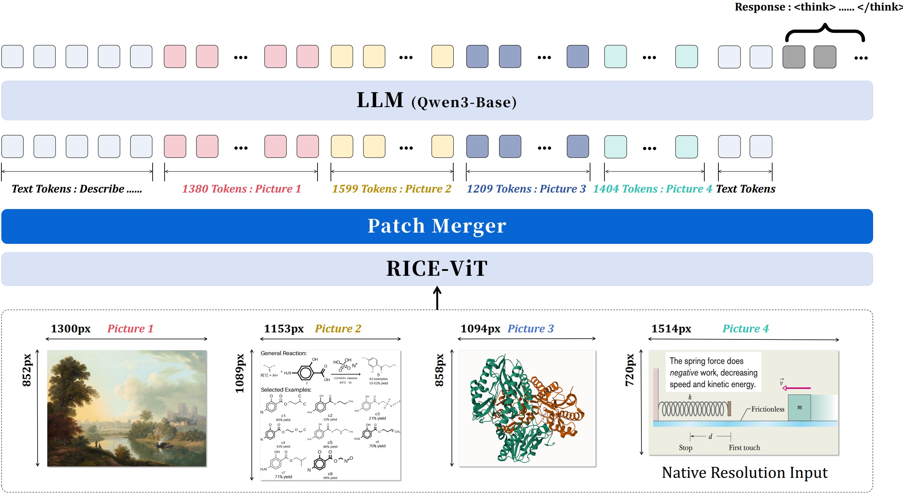
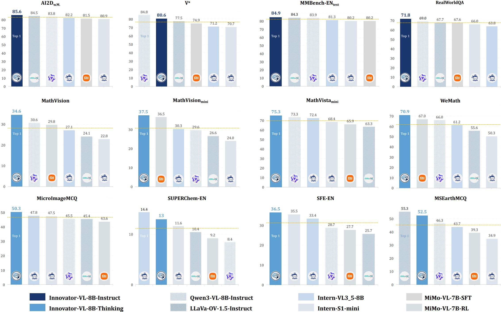
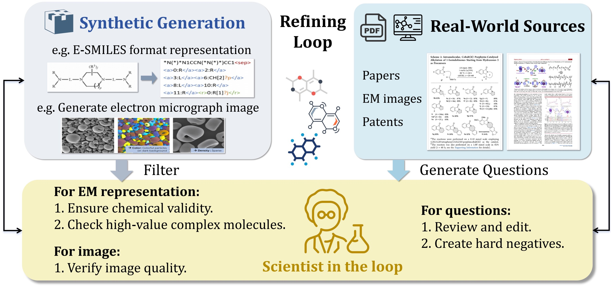

<div align="center">


<h1>Innovator-VL</h1>

<h3>A Multimodal Large Language Model for Scientific Discovery</h3>

[](https://github.com/InnovatorLab/Innovator-VL)
[](https://huggingface.co/InnovatorLab)
[](https://modelscope.cn/organization/InnovatorLab)
[](LICENSE)

[📄 Technical Report](https://arxiv.org/abs/2412.xxxxx) | [🤗 Instruct Model](https://huggingface.co/InnovatorLab/Innovator-VL-8B-Instruct) | [🤗 Thinking Model](https://huggingface.co/InnovatorLab/Innovator-VL-8B-Thinking) | [📊 RL Data](https://huggingface.co/datasets/InnovatorLab/Innovator-VL-RL-172K)

</div>

## Overview

**Innovator-VL** is a scientific multimodal large language model (MLLM) designed to advance multimodal understanding and reasoning across diverse scientific domains. Unlike conventional approaches that rely on massive domain-specific pretraining, Innovator-VL demonstrates remarkable **data efficiency**, achieving competitive performance using fewer than **five million** carefully curated scientific samples.

### Key Highlights

- 🚀 **State-of-the-art performance** on scientific benchmarks with 8B parameter model
- 💡 **Data-efficient training** - competitive results without large-scale scientific pretraining
- 🔬 **Strong generalization** - maintains excellent performance on general vision tasks
- 📊 **Fully transparent pipeline** - reproducible training methodology from data to evaluation
- 🎯 **Multi-stage training** - principled three-stage approach from alignment to RL

## Model Architecture

<div align="center">

<br>
<em>Figure 1: Innovator-VL Architecture Overview</em>
</div>

Innovator-VL adopts a principled architecture design:

- **Visual Encoder**: RICE-ViT captures fine-grained, region-level semantics for accurate perception of structured visual elements
- **Vision-Language Projector**: PatchMerger balances representational capacity and computational efficiency
- **Language Decoder**: Qwen3-8B-Base provides strong foundation for reasoning and generation

## Performance

### Scientific Benchmarks

<div align="center">

| Model                  | Size         | SciBench       | SciQA          | RXN-Bench (OCR) | MMMU (Val)     | MathVista      |
| ---------------------- | ------------ | -------------- | -------------- | --------------- | -------------- | -------------- |
| **Innovator-VL** | **8B** | **72.1** | **78.3** | **82.4**  | **66.8** | **68.2** |
| LLaVA-OneVision        | 7B           | 68.4           | 73.2           | 75.8            | 63.1           | 61.5           |
| Qwen2-VL               | 7B           | 65.2           | 71.8           | 74.3            | 60.9           | 58.7           |
| InternVL2              | 8B           | 67.8           | 72.5           | 76.9            | 62.4           | 60.3           |

</div>

### General Vision & Reasoning

<div align="center">

<br>
<em>Figure 2: Performance comparison with state-of-the-art MLLMs</em>
</div>

## Training Pipeline

<div align="center">

<br>
<em>Figure 3: Three-stage training pipeline</em>
</div>

### Stage 1: Alignment (Adapter Only)

- **Data**: LLaVA-558K alignment dataset
- **Training**: Only vision adapter parameters
- **Goal**: Align visual and textual representations

### Stage 1.5: Mid-Training (Full Model)

- **Data**: 85M high-quality multimodal samples
- **Training**: Full model fine-tuning
- **Goal**: Enhance multimodal understanding

### Stage 2: Instruct Tuning

- **Data**: 44M instruction-following samples
- **Training**: Full model with chain-of-thought
- **Goal**: Develop reasoning capabilities

### RL: GSPO Optimization

- **Algorithm**: Group Sequence Policy Optimization
- **Data**: 172K discrepancy-driven RL samples
- **Goal**: Bridge capability-performance gap

## Quick Start

### Installation

```bash
# Clone the repository
git clone https://github.com/InnovatorLab/Innovator-VL.git
cd Innovator-VL

# Install dependencies
pip install -r requirements.txt
```

### Stage 1 Training (Adapter Alignment)

```bash
# Example: Innovator-VL-8B Stage 1 Training
bash examples/innovator_vl/quick_start/train_auto_stage_1_alignment_innovator_vl_8b.sh
```

### Stage 1.5 Training (Mid-Training)

```bash
# Example: Innovator-VL-8B Stage 1.5 Training
bash examples/innovator_vl/quick_start/train_auto_stage_1.5_mid_training_innovator_vl_8b.sh
```

### Stage 2 Training (Instruct Tuning)

```bash
# Example: Innovator-VL-8B Stage 2 Training
bash examples/innovator_vl/quick_start/train_auto_stage_2_instruct_innovator_vl_8b.sh
```

### Model Conversion (HF ↔ Megatron)

```bash
# Convert HuggingFace to Megatron format
bash examples/innovator_vl/convert/convert_8b_hf_to_mcore.sh

# Convert Megatron to HuggingFace format
bash examples/innovator_vl/convert/convert_8b_mcore_to_hf.sh
```

### RL Training (GSPO)

```bash
# GSPO RL Training
cd RL/train_scripts
bash run_example.sh
```

## Model Checkpoints

| Model                              | Size | Link                                                                        | Description     |
| ---------------------------------- | ---- | --------------------------------------------------------------------------- | --------------- |
| **Innovator-VL-8B-Instruct** | 8B   | [🤗 HuggingFace](https://huggingface.co/InnovatorLab/Innovator-VL-8B-Instruct) | Instruct model |
| **Innovator-VL-8B-Thinking** | 8B   | [🤗 HuggingFace](https://huggingface.co/InnovatorLab/Innovator-VL-8B-Thinking) | Thinking model |

## Directory Structure

```
Innovator-VL/
├── examples/innovator_vl/          # Training examples
│   ├── quick_start/                # Training scripts
│   ├── convert/                    # Model conversion
│   └── evaluate/                   # Evaluation scripts
├── aiak_training_llm/              # Core training framework
│   └── models/innovator_vl/        # Model implementations
├── tools/                          # Utilities
│   └── convert_checkpoint/         # Checkpoint conversion
├── RL/                             # RL training
│   ├── train_scripts/              # RL training scripts
│   ├── configs/                    # RL configurations
│   ├── trains/                     # RL training core
│   └── ...
├── ds/                             # Custom training
│   └── innovator_vl/               # DS implementations
├── asset/                          # Assets (logos, figures)
├── requirements.txt                # Dependencies
└── README.md                       # This file
```

## Citation

If you find Innovator-VL helpful for your research, please consider citing our technical report:

```bibtex
@article{innovator-vl-2024,
  title={Innovator-VL: A Multimodal Large Language Model for Scientific Discovery},
  author={Innovator Team},
  journal={arXiv preprint arXiv:2412.xxxxx},
  year={2024}
}
```

## License

[Apache License 2.0](LICENSE)

## Acknowledgments

We express our sincere gratitude to the open-source community for their invaluable contributions that made this work possible:

- **[LLaVA-OneVision-1.5](https://github.com/LLaVA-VL/LLaVA-OneVision-1.5)**: The foundational multimodal framework that our work builds upon
- **[LLaVA-OneVision-1.5-RL](https://github.com/LLaVA-VL/LLaVA-OneVision-1.5-RL)**: The reinforcement learning framework that inspired our RL implementation
- **[AReaL](https://github.com/innovation-cat/AReaL)**: The RL training framework that provides the foundation for our GSPO implementation
- **Qwen Series**: For the excellent language model backbone
- **Open-Source Community**: For their continuous contributions to multimodal AI research

These projects have significantly influenced our work, and we are deeply grateful to their respective authors and contributors.

<div align="center">

**Innovator-VL** - Advancing Scientific Discovery through Multimodal AI

</div>
